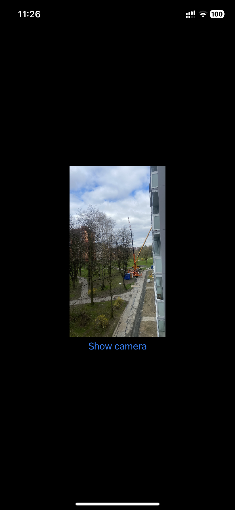

#  Simple Camera

This project is SwiftUI simple camera for taking photos and pass them to other parts of project.

## Description

Using AVFoundation library, this project creates `AVCaptureSession` with `AVCaptureVideoPreviewLayer` that is handled by UIViewRepresentable. Camera view frame is set by `Geometry reader` to fill whole screen. After taking photo, the captured image is shown instead of camera view, user then can retake or save photo. Save photo is passed by `@Binding` variable to its parent view. 
This project also follows `MVVM` architecture.

## Showcase

   

## Usage

To explore SimpleCameraCapture on your iOS device or simulator:

- Clone the repository to your local machine.
- Open the project in Xcode.
- Build and run the project on your device or simulator.

## Techstack Used

- SwiftUI
- Swift
- AVFoundation
- MVVM

# Code info

How I solved coding problems and how I used technologies.

## AV Capture

### AVCaptureManager.swift

I have to check camera permission, I created variable `cameraPermision` that track status of permission, then I create method, that check permission by switching on `AVCaptureDevice.authorizationStatus(for: .video)`. if access is granted, then I can set up camera for preview.

```swift
    func checkCameraPermision() throws {
        switch AVCaptureDevice.authorizationStatus(for: .video) {
        case .authorized:
            cameraPermission = .approved
            try setupCamera()
        case.notDetermined:
            // requesting camera access
            Task {
                if await AVCaptureDevice.requestAccess(for: .video) {
                    // Access granted
                    try await MainActor.run {
                        cameraPermission = .approved
                        try setupCamera()
                    }
                } else {
                    // access denied
                    try await MainActor.run {
                        cameraPermission = .denied
                        throw CustomError.cameraAccessDenied
                    }
                }
            }
        case .denied, .restricted:
            cameraPermission = .denied
            throw CustomError.cameraAccessDenied
        default: break
        }
    }
```

Setup camera for video preview and photo taking, I have created startSession method, because I have to use it few places in code. I push startsession in background thread.

```swift
        func setupCamera() throws {
        self.photoCaptureState = .notStarted
        self.outputData = nil

        if !isSessionConfigured {
            self.session.beginConfiguration()
            guard let backCamera = AVCaptureDevice.default(for: .video) else { throw CustomError.setupCameraFailed }
            guard let input = try? AVCaptureDeviceInput(device: backCamera) else { throw CustomError.setupCameraFailed }

            if session.canAddInput(input) {
                session.addInput(input)
                if session.canAddOutput(cameraOutput) {
                    session.addOutput(cameraOutput)
                    self.session.commitConfiguration()
                    self.isSessionConfigured = true
                    self.startSession()
                }
            }
        } else {
            self.startSession()
        }
    }

    func startSession() {
        DispatchQueue.global(qos: .background).async {
            self.session.startRunning()
        }
    }
```

## Using UIViewRepresentable to show camera input

### CameraViewRepresentable.swift

I have passed CGRect frame constant to create frame of preview, and I have added AV session to preview. when cameraVM change method updateUIView change the frame, this implementation is solving the landscape orientation shift.

```swift
struct CameraViewRepresentable: UIViewRepresentable {
    let frame: CGRect
    @ObservedObject var cameraVM: CameraViewModel

    func makeUIView(context: Context) -> UIView {
        let view = UIViewType(frame: frame)
        view.backgroundColor = .clear

        AVCaptureManager.shared.preview.session = AVCaptureManager.shared.session
        AVCaptureManager.shared.preview.frame = frame
        AVCaptureManager.shared.preview.videoGravity = .resizeAspectFill
        let orientation = UIDevice.current.orientation
        AVCaptureManager.shared.preview.connection?.videoRotationAngle =  orientation.videoRotationAngle
        AVCaptureManager.shared.preview.masksToBounds = true

        view.layer.addSublayer(AVCaptureManager.shared.preview)
        return view
    }

    func updateUIView(_ uiView: UIView, context: Context) {
        AVCaptureManager.shared.preview.frame = frame
        AVCaptureManager.shared.preview.connection?.videoRotationAngle = UIDevice.current.orientation.videoRotationAngle
    }
}
```

## Error handling

I have created custom errors for this app.

```swift
    enum CustomError: Error, LocalizedError {
    case cameraAccessDenied
    case setupCameraFailed

    var errorDescription: String? {
        switch self {
        case .cameraAccessDenied:
            return "Please provide access to camera for capture"
        case .setupCameraFailed:
            return "Camera setup failed, please try again."
        }
    }
}
```

# Future Enhancement

Things I can add or change in the future

- landscape buttons on right side of the screen
- try not to use ViewRepresentable
